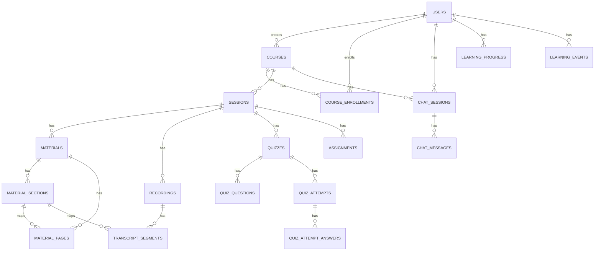

# 데이터베이스 스키마 설계

## 1. 설계 원칙

본 프로젝트의 스키마는 다음 원칙을 기반으로 설계한다.

1. 강의, 세션, 자료, 녹화본, 퀴즈, 질의응답을 분리된 엔티티로 관리한다.
2. 강의자료의 구조 정보(목차, 페이지별 정보)는 별도 테이블로 분리한다.
3. 녹화본의 자막 정보는 타임스탬프 단위로 저장하여 탐색 기능에 활용한다.
4. 유저와 강의의 관계는 다대다 관계를 고려하여 별도 등록 테이블로 관리한다.
5. AI 처리 상태는 비동기 파이프라인을 고려하여 상태값으로 관리한다.

---

## 2. 주요 엔티티

### users
사용자 정보 테이블

- id
- name
- email
- password_hash
- role (`student`, `instructor`, `admin`)
- profile_image_url
- created_at
- updated_at

### courses
강의 정보 테이블

- id
- title
- description
- instructor_user_id
- start_date
- end_date
- capacity
- status (`draft`, `open`, `closed`, `archived`)
- thumbnail_url
- created_at
- updated_at

### course_enrollments
수강 신청 및 수강 상태 관리 테이블

- id
- course_id
- user_id
- status (`applied`, `enrolled`, `dropped`, `completed`)
- progress_percent
- applied_at
- enrolled_at
- updated_at

### sessions
강의 내 세션(회차/주차) 정보 테이블

- id
- course_id
- title
- description
- order_index
- start_at
- end_at
- visibility (`draft`, `published`, `hidden`)
- created_at
- updated_at

### materials
강의자료 파일 정보 테이블

- id
- session_id
- type (`lecture_pdf`, `assignment_pdf`, `quiz_pdf`, `reference`, `other`)
- name
- file_url
- mime_type
- page_count
- is_locked
- extract_enabled
- processing_status (`uploaded`, `queued`, `processing`, `completed`, `failed`)
- created_at
- updated_at

### material_sections
자료의 목차/섹션 정보 테이블

- id
- material_id
- parent_section_id
- title
- level
- start_page
- end_page
- order_index
- created_at
- updated_at

### material_pages
자료의 페이지별 분석 결과 테이블

- id
- material_id
- page_number
- section_id
- topic_sentence
- summary
- keywords (JSON)
- embedding_status (`pending`, `completed`, `failed`)
- created_at
- updated_at

### recordings
세션 녹화본 정보 테이블

- id
- session_id
- name
- video_url
- duration_seconds
- language
- stt_status (`uploaded`, `queued`, `transcribing`, `post_processing`, `completed`, `failed`)
- subtitle_url
- created_at
- updated_at

### transcript_segments
녹화본 자막 세그먼트 테이블

- id
- recording_id
- start_ms
- end_ms
- raw_text
- refined_text
- speaker_label
- section_id
- page_number
- confidence_score
- created_at
- updated_at

### quizzes
퀴즈 정보 테이블

- id
- session_id
- material_id
- section_id
- title
- generated_by (`ai`, `instructor`)
- status (`draft`, `published`, `hidden`)
- created_at
- updated_at

### quiz_questions
퀴즈 문항 테이블

- id
- quiz_id
- type (`multiple_choice`, `short_answer`, `ox`)
- question_text
- choices (JSON)
- answer
- explanation
- source_material_id
- source_page_number
- source_section_id
- created_at
- updated_at

### quiz_attempts
수강생 퀴즈 응시 테이블

- id
- quiz_id
- user_id
- score
- submitted_at
- created_at
- updated_at

### quiz_attempt_answers
퀴즈 응답 상세 테이블

- id
- attempt_id
- question_id
- user_answer
- is_correct
- earned_score
- created_at
- updated_at

### assignments
과제 정보 테이블

- id
- session_id
- title
- description
- due_at
- attachment_material_id
- is_locked
- created_at
- updated_at

### assignment_submissions
과제 제출 테이블

- id
- assignment_id
- student_user_id
- file_url
- submitted_at
- grade
- feedback
- status (`submitted`, `late`, `graded`)
- created_at
- updated_at

### chat_sessions
챗봇 대화 세션 테이블

- id
- course_id
- user_id
- created_at
- updated_at

### chat_messages
챗봇 메시지 테이블

- id
- chat_session_id
- role (`user`, `assistant`, `system`)
- content
- source_refs (JSON)
- created_at

### learning_progress
학습 진도 요약 테이블

- id
- user_id
- course_id
- session_id
- material_id
- recording_id
- progress_percent
- last_accessed_at
- created_at
- updated_at

### learning_events
학습 행동 로그 테이블

- id
- user_id
- event_type (`view_material`, `seek_video`, `complete_quiz`, `ask_chatbot`)
- target_type
- target_id
- metadata (JSON)
- created_at

---

## 3. 엔티티 관계 요약

- 한 명의 강사는 여러 강의를 개설할 수 있다.
- 한 강의는 여러 세션을 가진다.
- 한 세션은 여러 강의자료, 녹화본, 퀴즈, 과제를 가진다.
- 한 강의자료는 여러 목차와 페이지 정보를 가진다.
- 한 녹화본은 여러 자막 세그먼트를 가진다.
- 한 수강생은 여러 강의를 신청/수강할 수 있다.
- 한 강의는 여러 수강생을 가진다.
- 한 퀴즈는 여러 문항과 여러 응시 결과를 가진다.
- 한 사용자와 한 강의는 여러 챗봇 대화 세션을 가질 수 있다.

---

## 4. ERD

---

5. 상태값 설계
자료 처리 상태
uploaded: 업로드 완료
queued: 처리 대기 중
processing: 정보 추출 중
completed: 처리 완료
failed: 처리 실패
STT 처리 상태
uploaded: 업로드 완료
queued: 변환 대기
transcribing: STT 수행 중
post_processing: 후보정 중
completed: 완료
failed: 실패
공개 상태
draft: 초안 상태
published: 사용자 공개
hidden: 숨김 처리
6. MVP에서 우선 사용할 핵심 테이블

초기 MVP에서는 다음 테이블을 우선 구현한다.

users
courses
course_enrollments
sessions
materials
material_sections
material_pages
recordings
transcript_segments
quizzes
quiz_questions
quiz_attempts
chat_sessions
chat_messages

과제, 상세 학습 이벤트, 운영자 기능은 이후 확장 대상으로 둔다.

## 6. 운영·상태 필드 확장 제안

다음은 백엔드 구현 및 비동기 파이프라인 운영을 원활히 하기 위해 기존 스키마에 추가로 권장하는 필드와 테이블입니다. 이 항목들은 파이프라인 안정성(재시도/아이덴포텐시/오류 추적)과 검색 준비(임베딩) 관점에서 유용합니다.

### 공통 권장 필드
- `retry_count` (integer): 외부 API 호출/파이프라인 처리 시 재시도 횟수 기록
- `last_error` (text): 마지막 실패 원인 메시지 저장
- `last_attempted_at` (timestamp): 마지막 처리 시도 시간
- `next_retry_at` (timestamp, nullable): 재시도 예약 시간
- `idempotency_key` (string, nullable): 중복 처리를 방지하기 위한 작업 식별자

### `materials` 추가 권장 필드
- `failure_reason` (text, nullable)
- `retry_count` (integer, default 0)
- `last_error` (text, nullable)

### `material_pages` / 임베딩 관련
- 임베딩은 별도 테이블로 분리하는 것을 권장합니다: `embeddings`

`embeddings` 예시 테이블
- `id`
- `owner_type` (`material_page` | `transcript_segment`)
- `owner_id`
- `model_name`
- `vector` (pgvector)
- `dimension` (integer)
- `created_at`, `updated_at`

또는 간단한 구현을 위해 `material_pages`에 `embedding_status`와 `embedding_id` 필드를 유지할 수 있습니다.

### `recordings` / `transcript_segments` 권장 필드
- `transcript_segments`
    - `mapping_score` (float): 목차/페이지 매핑 신뢰도 (0.0–1.0)
    - `raw_confidence` (float, nullable)
    - `refinement_status` (`pending`|`refined`|`failed`)

### 운영 운영값 권장 (config 문서로 분리 가능)
- `WORKER_POLL_INTERVAL_SECONDS` = 5
- `MAX_RETRIES` = 3
- `BACKOFF_BASE_SECONDS` = 2 (지수 백오프)

위 제안은 MVP 단계에서 최소한의 운영 안전성을 확보하도록 설계되었습니다. 구현체(Prisma/ORM 또는 Raw SQL)에 맞게 필드명과 인덱스(예: `idempotency_key`, `next_retry_at` 인덱스)를 추가해 두면 큐 처리 효율이 향상됩니다.